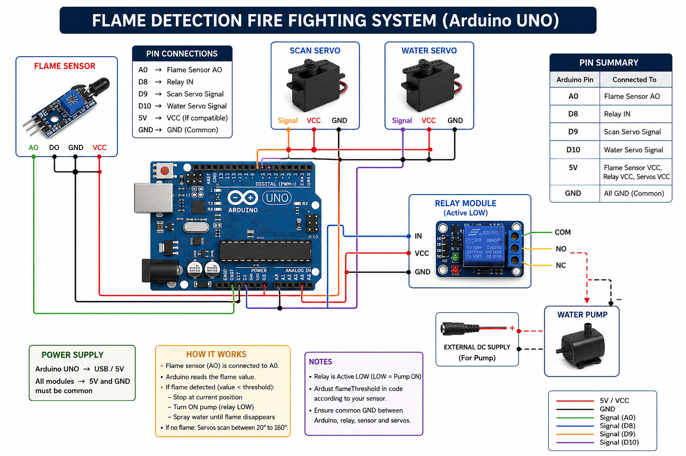

# 🔥 Arduino Fire Fighting System

An automatic fire-fighting system developed using Arduino Uno. The robot continuously scans the surroundings using servo motors. When a flame is detected, it immediately stops scanning, activates a water pump through a relay module, sprays water until the flame disappears, and then resumes scanning.

## Features

- Continuous flame scanning using servo motors
- Analog flame detection
- Automatic servo stop when flame is detected
- Relay-controlled water pump
- Automatic extinguishing until fire disappears
- Resumes scanning after extinguishing the flame

## Hardware Used

- Arduino Uno
- Flame Sensor
- 2 × SG90 Servo Motors
- 5V Relay Module
- Mini DC Water Pump
- External Power Supply
- Jumper Wires
- Breadboard

## Software

- Arduino IDE
- Servo Library

## Working Principle

1. Servo motors continuously scan between preset angles.
2. Arduino continuously reads the flame sensor.
3. When flame intensity crosses the threshold:
   - Servo scanning stops.
   - Relay turns ON the water pump.
   - Water continues spraying while the flame exists.
4. Once the flame disappears:
   - Pump turns OFF.
   - Servo scanning resumes automatically.

## Circuit Diagram

## Challenges Faced

- Synchronizing both servo motors during scanning.
- Calibrating the flame sensor threshold for reliable detection.
- Correcting relay wiring (NO/NC connection) to ensure proper pump control.
- Debugging the scanning and extinguishing logic.

## Team Contribution

This project was completed as a three-member team.
- One teammate identified and corrected the relay NO/NC wiring issue.
- All team members collaborated on component selection, hardware assembly, testing, and final integration.
My primary contributions included:

- Debugged and improved the Arduino program.
- Fixed the synchronization of the two servo motors.
- Implemented the logic to stop servo scanning when a flame is detected.
- Calibrated the flame sensor threshold based on testing and lecturer feedback.
- Tested and verified the complete system.

## Future Improvements

- Add multiple flame sensors
- Implement obstacle avoidance
- Upgrade to ESP32 with Wi-Fi monitoring
- Add battery management
- Improve fire localization accuracy

## License

MIT License
